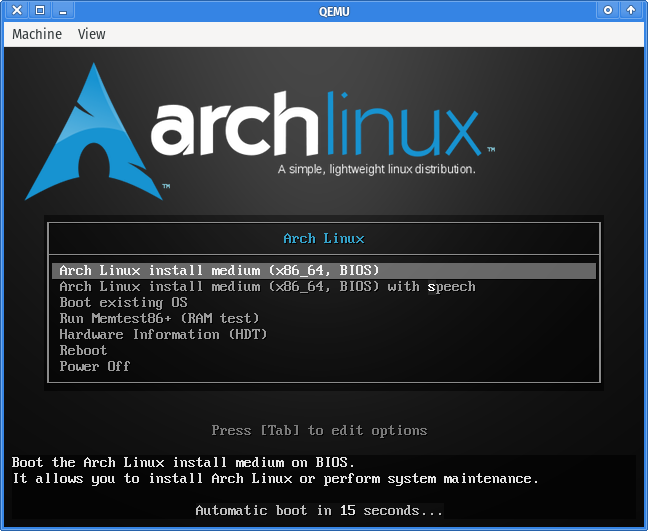

# 使用宿主机的目录作为 QEMU 虚拟机的主文件系统

一般我们在使用 KVM/QEMU 虚拟机时，都是需要创建一个  block 设备，然后格式化成文件系统作为里面的主文件系统（rootfs）来使用的。但这里有个问题，就是在创建设备文件时，需要预先设定该 block 设备的大小，一旦设置好，在使用过程中如果发现空间不足需要扩容，修改起来就不是那么方便了。

使用虚拟机的另一个问题就是怎么便捷地与宿主机交换文件，通常情况下会使用  nfs/smb 这些网络文件系统协议，但这需要先部署它们 才能使用，没办法做到开箱即用。

通过搜索发现有两种方案可以实现共享宿主机的目录给虚拟机用，分别是 [virtio-fs][] 和 [9pfs][]，virtio-fs 需要先启动 virtfsd 服务，通过 libvirt 来启动虚拟机时如果配置了共享目录，会自动启动该服务，但通过 qemu 直接启动虚拟时就需要手动启动 virtfsd 了。而 9pfs 则没有这个问题，是 qemu 内置支持的，也就是本文要介绍的方案了。

在两三年前，我就已经折腾过 9pfs，但那时只是试用了下就没有继续用了，印象中应该是有两个问题。

其中一个问题是文件在宿主机与虚拟机中的权限映射问题，例如有在里面用 root 用户创建一个文件，它在里面的 owner 是 root，那在外面应该是什么？这里 QEMU 提供了 security_model 参数用于控制，它的值分别是 passthrough, mapped(mapped-xattr), mapped-file, none，其中 mapped 在是将文件属性（的映射）保存在文件 xattr 属性里，mapped-file 则保存在独立的 .virtfs_metadata 文件夹内，而 none 和 passthrough 则不进行映射，none 的话相当于在虚拟机内创建的文件的 owner 为属主机的，并且无法使用 chown 来修改，passthrough 类似，但可以修改，这就要求 qemu 使用 root 权限来运行了，否则 chown 时提示权限不足。mapped 或者 mapped-file 选项对于有一点洁癖的我来说，是不希望有额外的信息写入到文件本身以及多余的是目录上的。而且这里有个很大的问题的，在宿主机上创建的文件，由于没有这些附加的属性，好像在虚拟机内是有问题的（太久的也忘记当时测的时候是什么问题了）。比较理想的是使用 passthrough 选项，使用该选项通常需要 root 权限运行 qemu，而且在虚拟机内如果使用 root 创建的文件，在宿主机上也是显示为 root owner 的文件，这样宿主机上普通用户要看的话也不方便。

而另一个问题是当时好像 linux kernel 还不支持 9p 作为 rootfstype 使用。

最近在 google 上搜索时，发现了 [9p_root_fs][] 这个 wiki，这第二个问题来起来已经解决。而刚好最近研究了下 user namespace，发现可以使用 unshare 将当前宿主机上的普通使用切换到 root 来运行，这样对于第一个问题也比较好的解决了。

下面将以安装 Arch Linux 为例，主要参考的是 [9p_root_fs][]，这 wiki 使用安装 debian 来例。

先确认下 `/etc/subuid` 及 `/etc/subgid` 里已经有当前用户的 subuid 及 subgid 的 map 配置：

```/etc/subuid
<CURRENT_USER>:10000:65536
```

```/etc/subgid
<CURRENT_USER>:10000:65536
```

下载好 Arch Linux 的安装镜像，然后运行：


```bash
unshare --map-auto --map-root-user \
qemu-system-x86_64 -machine pc,accel=kvm,dump-guest-core=off -m 2048 \
  -smp 4,sockets=1,dies=1,cores=4,threads=1 -rtc base=utc \
  -boot d -cdrom ./archlinux-x86_64.iso \
  -fsdev local,security_model=passthrough,id=fsdev-fs0,multidevs=remap,path=$PWD/base \
  -device virtio-9p-pci,id=fs0,fsdev=fsdev-fs0,mount_tag=fs0
```

其中 `./archlinux-x86_64.iso` 为下载的安装镜像，`path=$PWD/base` 配置的分享目录当前目录下的 `base` 文件夹。



运行后在弹窗的窗口中选择第一项，回车，进入命令行。

先挂载 9pfs 到 /mnt 目录上：

```bash
mount -t 9p -o trans=virtio,version=9p2000.L,posixacl,msize=5000000,cache=mmap fs0 /mnt
```

然后就可以将基础包安装到 /mnt 目录了：

```bash
pacstrap -K /mnt base base-devel linux vim man-db man-pages
```

装完之后运行 `arch-chroot` 切换到 /mnt：

```bash
arch-chroot /mnt
```

进行一些基本的配置，这个跟传统的 Arch Linux 安装类似，可以参考 https://wiki.archlinux.org/title/Installation_guide 

然后在配置 initramfs 时将 9p 的相关模块配置进去，修改 `/etc/mkinitcpio.conf` 里的 `MODULES=()` 为：

```conf
MODULES=(9p 9pnet 9pnet_virtio)
```

保存，然后使用 `mkinitcpio -p linux` 重新生成 `/boot/initramfs-linux.img`。

initramfs 文件生成好后，运行下 `passwd` 修改好密码，安装就算完成了。这时可以退出 chroot 环境，然后运行 `systemctl poweroff` 关机了。


现在可以运行以下命令来启动系统了：

```bash
unshare --map-auto --map-root-user \
qemu-system-x86_64 -machine pc,accel=kvm,dump-guest-core=off -m 4096 \
  -smp 4,sockets=1,dies=1,cores=4,threads=1 -rtc base=utc \
  -boot strict=on -kernel $PWD/base/boot/vmlinuz-linux \
  -initrd $PWD/base/boot/initramfs-linux.img \
  -append 'root=fsRoot rw rootfstype=9p rootflags=trans=virtio,version=9p2000.L,msize=5000000,cache=mmap,posixacl console=ttyS0' \
  -fsdev local,security_model=passthrough,multidevs=remap,id=fsdev-fsRoot,path=$PWD/base \
  -device virtio-9p-pci,id=fsRoot,fsdev=fsdev-fsRoot,mount_tag=fsRoot \
  -sandbox on,obsolete=deny,elevateprivileges=deny,spawn=deny,resourcecontrol=deny
```

启动后需要配置下网络，分别开启 `systemd-networkd` 和 `systemd-resolved` 服务：

```bash
systemctl enable --now systemd-networkd.service
systemctl enable --now systemd-resolved.service
```

编辑 `/etc/systemd/network/20-wire.network`，添加以下内容：

```systemd-network
[Match]
Name=ens*

[Network]
DHCP=yes
```

保存，然后运行下 `networkctl reload` 使配置生效。


NOTE: 如果在安装完成后在安装某个包时出错安装不了，可以先运行下 `pacman-key --populate` 更新下 key


[virtio-fs]: https://www.tauceti.blog/posts/qemu-kvm-share-host-directory-with-vm-with-virtio/
[9pfs]: https://wiki.qemu.org/Documentation/9p
[9p_root_fs]: https://wiki.qemu.org/Documentation/9p_root_fs