# 关于网站跳转、弹窗、唤起 APP 的“伪”技术分析（知乎篇）

首先，这里的网站跳转、弹窗、唤起 APP 都是指在非用户的意愿下、擅自将用户带离当前 
页面，跳转到或弹出一些广告、推广的页面或唤起 APP 来执行一些广告或推广操作。 
主要目的是获取广告展示或点击的收益、下载安装推广软件（APP）的收益以及唤起 APP 
获取其举办的活动收益。

上面的这些行为可以分为主动跟被动的。主动指是网站自己加入相关代码来触发，这种一般 
出现在一些垃圾站上。被动是指网站被植入了恶意代码而触发的，这种情况可能是网站自己 
并不知情的，但能发生这种情况，说明存在安全漏洞，或者安全方面做得不到位，导致网站 
的流量被劫持了。

流量劫持，有可能发生 ISP 的通信设备上，还有可能在用户的路由器、电脑里（被安装了恶意软件）。

流量劫持是如何发生的呢？

先简单说下我们打开一个网站，其背后所发生的一个过程。

在浏览器中，从我们输入一个链接（URL），按回车后。

首先浏览器会将链接的域名部分提取出来，进行域名解析，以得到一个 IP 地址。

这里可能会发生第一次被劫持：DNS 劫持。那 DNS 劫持是如何发生的呢？

域名解析时，操作系统一般会向指定的 DNS 服务器请求解析，这个 DNS 服务器地址一般 
是由 ISP 提供，也可以由自己来设置。如果操作系统的 DNS 服务器设置被恶意篡改了， 
当系统向恶意的 DNS 服务器请求解析时，返回的 IP 地址可能已经不是真正的链接网站 
的 IP 地址了。这样连接访问的内容就被劫持了。

另外还有一种 DNS 劫持，发生在我们向 DNS 服务器请求后，在 DNS 服务器返回结果到达 
我们的操作系统前，中途被链路上经过的有关设备抢先返回了。由于 DNS 协议的缺陷，导 
致我们的操作系统先接受了先返回 IP 地址。

我们得到 IP 地址后，浏览器会向 IP 地址发起建立 TCP 连接请求。在连接建立后，如果 
我们的链接是 `http://` 开头的，会直接发起 HTTP 请求，但由于 HTTP 协议是明文 
（plaintext）协议，这就可能会发生被劫持。同样的，可以劫持 HTTP 请求的，还可能是 
链路上途经的设备。如果本地路由器或终端被植入了恶意软件，或浏览器安装了恶意扩展 
（插件），也就可能劫持 HTTP 请求的。

如果链接是以 `https://` 开头，在建立 TCP 连接后，会先在其上面建立一条加密的安全 
隧道，即（SSL/TLS）。TLS 的建立需要向服务器端请求包含该链接的域名的证书，浏览器 
在拿到证书后，通过浏览器或系统内置的根证书对其证书校验。只有校验通过后，TLS 才 
成功建立，如果校验不通过，浏览器会直接拒绝该连接。

在建立 TSL 连接后，浏览器就可以安全地向服务器发起 HTTP 请求了，因为连接是经过加 
密的，所以沿途的设备就无法对其进行劫持了。但是，如果浏览器安全了恶意的扩展（插 
件），还是可以对其内容进行篡改的。

上面的废话好像有点多了 :)，还是进入本文的主题吧。

先交待下背景。

最近这几天（2020-08-05），使用手机的浏览器（Firefox）打开知乎的链接时，总是会跳 
转到一个淘宝的商品列表页面，看了下这个页面的链接，发现带有一个 `pid` 参数，熟悉 
淘宝客的同学应该都知道，这是一个带有返利推广的页面来的。我心想，知乎不会缺钱到 
这种份上吧，这种严重影响到用户体验的骚操作一般只会在一些垃圾站出现的。在带有这 
样的疑问下，也就有了这样一篇文章，算是做下笔记吧。

其实，我最先怀疑的对象并不是知乎，而是电信运营商，会什么呢，有经验吧 ;)，这种事 
在几年前是经常发生的，特别是在一些小的 ISP 上，或者在农村（有一段时间我就亲身经 
历过）。不过现在由于 HTTPS 的普及，以及其他一些情况，这种事基本上已经消失了。

那现在这种是什么情况呢？

由于手机端查看不了请求，而刚好我手机端的 [Firefox 版本是 68](https://developer.mozilla.org/en-US/docs/Tools/about:debugging#Connection_to_Firefox_for_Android_68)， 
无法在 PC 的 Firefox 上使用 Remote Debugging，因此这里使用 chromium 来测试。

打开 chromium，按 F12 打开 DevTools，开启模拟移动端的 UA ，打开从手机端复制过来 
的知乎的链接，发现可以成功复现了。

先检查知乎链接的 HTTPS 证书，发现证书是知乎的（如下图），因此这里就排除了电信运营商嫌疑了。

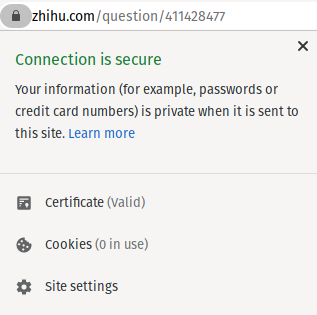
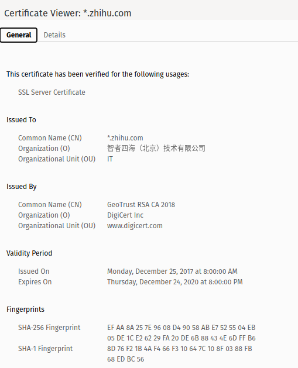

问题回到知乎上来，先从 HTTP 请求以及源码入手分析。

从地址栏右侧显示的拦截弹出窗口的提示图标里找到了具体的弹窗链接：

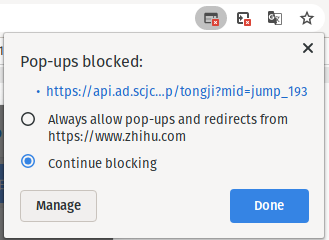

鼠标移到链接上，显示的完整地址为：`https://api.ad.scjcgj.top/api/jump/tongji?mid=jump_193`

用 `whois` 查了下这个 `scjcgj.top` 域名，发现经过隐私保护了。

来到 DevTools 窗口中，点击 `Network` 切换到 Network 面板。

先设置下界面，以方便分析。点击面板右边的设置图标按钮，然后按下图来进行设置：

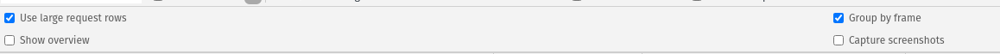

然后在列表的表头处右键，弹出的菜单选项按如下设置：

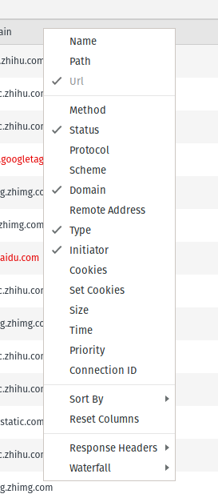

经过设置后，我们就很容易的找到跟上面链接接近的域名（`ad.scjcgj.top`）了：

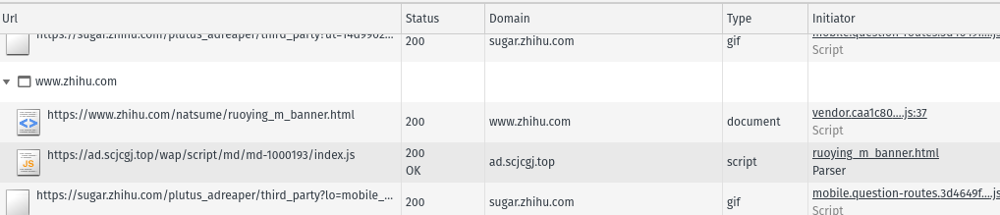

从上图可以看出来，这是一个 JS 文件，由 `https://www.zhihu.com/natsume/ruoying_m_banner.html` 引入。

这个 `https://www.zhihu.com/natsume/ruoying_m_banner.html` 就是这次问题的根源了，但先不说这个。

点击一下该行，在弹出的窗口里可以看到该请求的详情窗口。

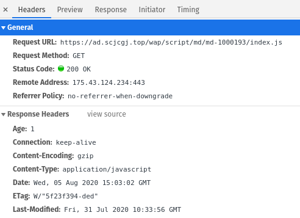

我们切换到 `Response` 标签，直接查看它的源码。

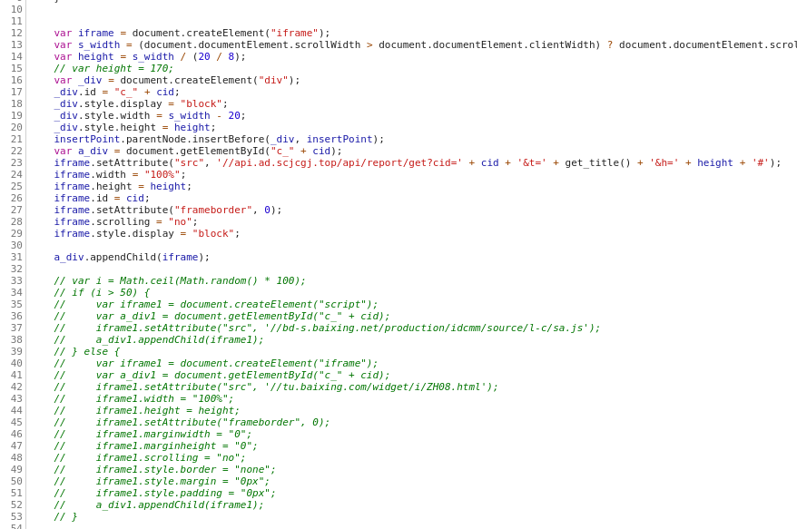

这里有点意思，不知道他们是不是故意的，这里有一段已经被注释的代码，它看起来像是 
正常的广告代码来的，而未注释的代码与它的功能基本一样，都是创建一个 iframe，并加 
载一个链接。个人猜测，注释掉的代码应该是为了应付审核用的吧，在审核通过后，就 
直接加载恶意的代码了。

我们继续分析这个 iframe 加载的链接，这个链接的域名是 `api.ad.scjcgj.top`，因为是 
iframe 加载的，DevTools 经过上面的设置后，很容易就可以找出来了。

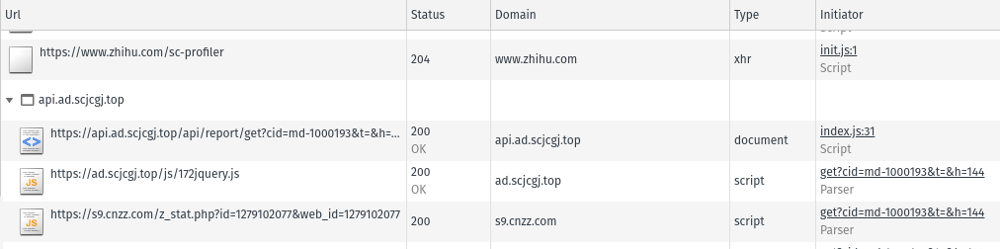

点击弹出详情，切换到 Response 标签查看源码，这里的代码比较正常，需要继续分析它 
加载的 JS，但这里加载的比较多，一个一个的看有点麻烦。不用担心，点击旁边的 
`Initiator` 标签，是不是发现了点什么？

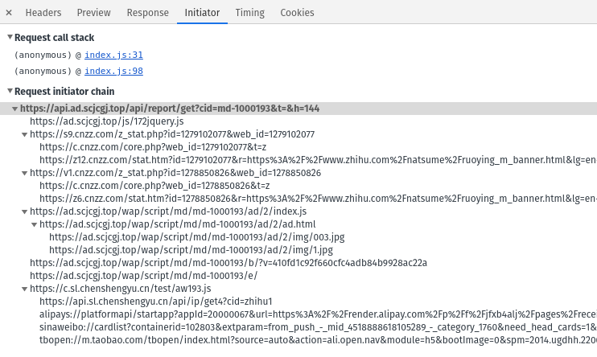

这里列出页面 `https://api.ad.scjcgj.top/api/report/get?cid=md-1000193&t=&h=144` 
里所有请求的请求链，并且已经按调用关系层级地排列好了。

如果注意看的，可以看到最后的三行的链接比较异常，这是一种自定义的协议链接，如果 
应用在系统里注册了某个自定义协议，在浏览器里打开这个自定义协议的链接，就会调用 
这个应用来处理这个链接。简单地说，也就可以通过点击这个链接来唤起该应用。在移动 
设备为王的国内互联网环境里，这种方式已经用得炉火纯青了。

看开头的协议，我猜这三个链接分别是调用 alipay、新浪微博、以及淘宝的 APP 来的，具 
体作用这里就不分析，有兴趣的可以去研究下。

从图中可以看到这三个链接都是由 JS `https://c.sl.chenshengyu.cn/test/aw193.js` (`whois chenshengyu.cn`）调用请求的。
找到这个 JS 并查看里面的内容，发现上面的三个链接是服务器端配置分发的，由接口 `https://api.sl.chenshengyu.cn/api/ip/get4?cid=zhihu1`
返回。这里还“人性化”地设置了时间控制，在 12 小时内，只调用一次，我猜这样可能就 
不会引用用户的警觉吧。

按理说，到这里算是分析完成了，但回头看下，好像还没找到前面所说的那个弹窗的出处呀。

继续分析。

回到前面那张图里，除了 `https://c.sl.chenshengyu.cn/test/aw193.js` 之外，看起来比较 
异常的 JS 还有（其他的几个其中一个是引入 JQuery 库，以及 cnzz 的统计代码）：

* https://ad.scjcgj.top/wap/script/md/md-1000193/ad/2/index.js
* https://ad.scjcgj.top/wap/script/md/md-1000193/b/?v=410fd1c92f660cfc4adb84b9928ac22a
* https://ad.scjcgj.top/wap/script/md/md-1000193/e/

我们一个一个来看：

`https://ad.scjcgj.top/wap/script/md/md-1000193/ad/2/index.js` 这个 JS 也创建了一个 iframe。
加载的链接为 `https://ad.scjcgj.top/wap/script/md/md-1000193/ad/2/ad.html`，查 
看了里面的内容，看起来比较正常。

`https://ad.scjcgj.top/wap/script/md/md-1000193/b/?v=410fd1c92f660cfc4adb84b9928ac22a` 这个 JS 的
内容看起来就比较流氓了：

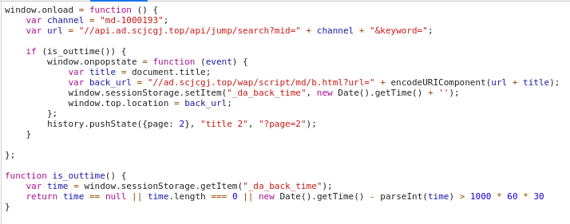

这里代码的意思是当你按回退键时，它会阻止你回退到上一页，直接将你带到它指定的页面里去。

`https://ad.scjcgj.top/wap/script/md/md-1000193/e/` 终于从这个 JS 里找到开头说的 
那个弹窗自动调用的代码了：

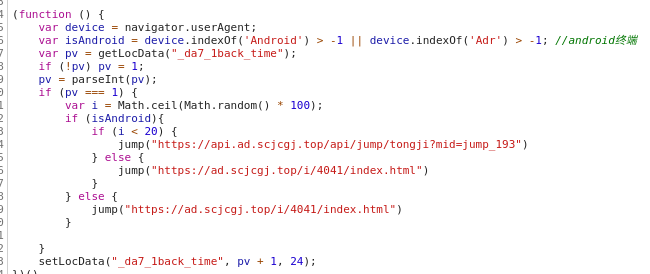

现在回过头来看下，发现这些网站耍起流氓来手段无所不用其极呀。不过，这个网站能乘 
上知乎这辆流量大巴，我觉得还是知乎安全方面做得还不够好，让它能够有可乘之机。很 
明显的，你在一个主域名的页面里（`https://www.zhihu.com/natsume/ruoying_m_banner.html`）引入 
一个这样的不受控、看起来明显不正常的第三方域名的 JS，这相当于用户对于它来说是完 
全透明的。这次它用在恶意弹窗方面可能对用户造成不了什么损失，但如果哪天它用这个 
来窃取用户信息，造成的损失谁来买单呢？（PS：这让我想起之前看到过不少新浪微博的 
用户无缘无故多了很多未知的关注，这里面是否有类似的问题呢？）
